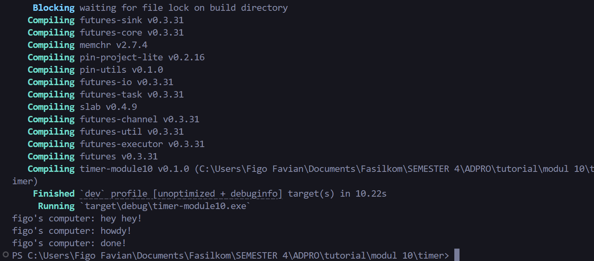

## 1.2 Understanding How It Works

"hey hey!" di print terlebih dahulu karena di call di luar fungsi `async`. Kemudian `main` tetap meneruskan program sambil menunggu hasil `future` dari fungsi `async`.

Bukti: 

