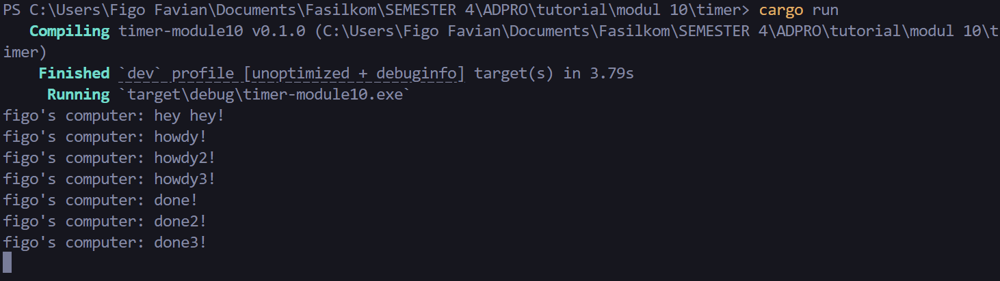
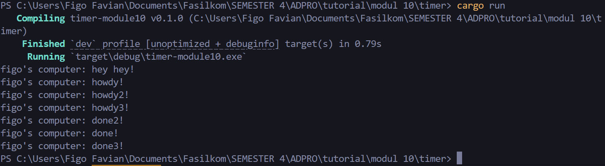

## 1.2 Understanding How It Works

"hey hey!" di print terlebih dahulu karena di call di luar fungsi `async`. Kemudian `main` tetap meneruskan program sambil menunggu hasil `future` dari fungsi `async`.

Bukti: 

## 1.3 Multiple Spawn and Removing Drop

### Drop On:

Menghilangkan `drop(spawner)` akan menyebabkan program tidak berhenti. , `spawner` akan membuat _task_ baru yang disalurkan ke _task sender_ saat fungsi `spawn` dipanggil. Salah satu _task_ dari _task sender_ akan diambil dan kemudian di eksekusi oleh `Executor`, lalu _task_ yang baru akan diambil sampai habis. `spawner` seharusnya di-_drop_ karena hal tersebut mengindikasikan bahwa interaksi sudah selesai.

Bukti:

### Drop Off:

Namun jika `drop(spawner)` masih ada, maka akan berhenti.

Bukti:

